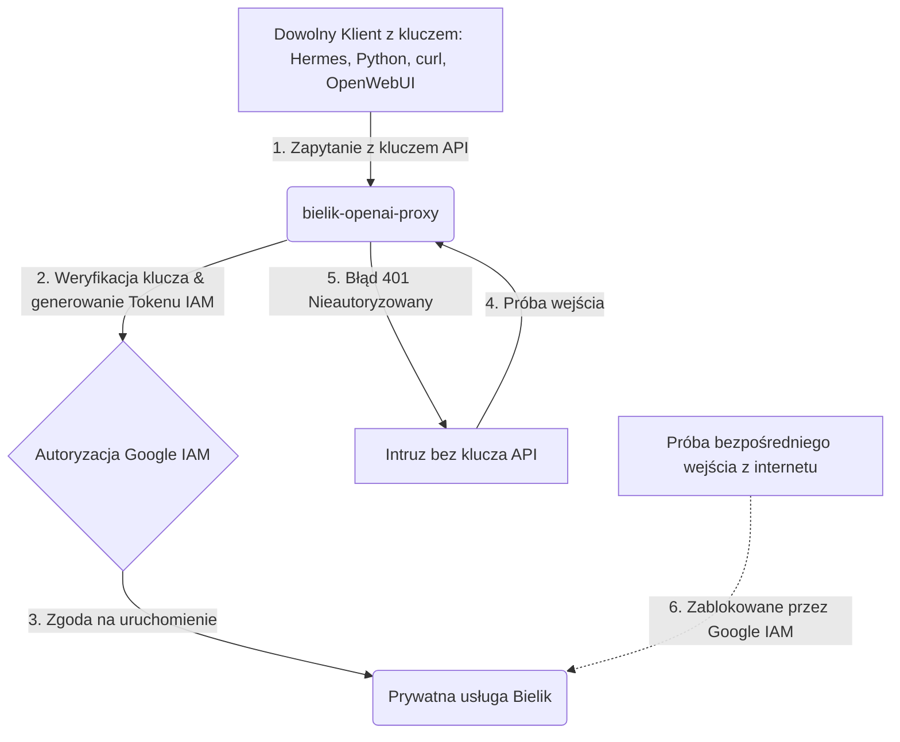

# Bielik OpenAI Proxy - Dokumentacja Techniczna

## Przegląd Architektury

Bielik OpenAI Proxy to usługa pośrednicząca (proxy), która konwertuje prywatny endpoint Ollama/Bielik na kompatybilny z OpenAI API. Pozwala to zewnętrznym klientom (np. Hermes, OpenAI SDK) na korzystanie z polskiego modelu Bielik bez konieczności implementacji specyficznego protokołu Ollama.

### Kluczowe cechy:

- **OpenAI-kompatybilny API**: Obsługuje standardowe endpointy OpenAI (`/v1/models`, `/v1/chat/completions`)
- **Autoryzacja dwustopniowa**: Walidacja klucza zewnętrznego + Google ID Token
- **Transformacja protokołu**: Automatyczna konwersja między formatami OpenAI i Ollama
- **Obsługa streaming**: Pełne wsparcie dla SSE (Server-Sent Events)
- **Pełna suwerenność danych**: Wszystkie przetwarzanie odbywa się wewnątrz Google Cloud

## Infrastruktura Fizyczna

### Lokizacja Serwera

- **Region**: `europe-west1`
- **Data Center**: St. Ghislain, Belgia
- **Suwerenność danych**: Dane nie opuszczają terenu Unii Europejskiej

### Parametry Sprzętowe

Każda instancja Cloud Run z modelem Bielik posiada:

- **GPU**: 1x NVIDIA L4 (karta dedykowana do wnioskowania AI/LLM)
- **CPU**: 8 dedykowanych rdzeni wirtualnych (vCPU)
- **RAM**: 16 GB pamięci operacyjnej
- **Skalowanie**: Scale-to-zero (oszczędność kosztów przy braku ruchu)

### Model LLM

- **Nazwa**: `SpeakLeash/bielik-4.5b-v3.0-instruct:Q8_0`
- **Precyzja**: 8-bitowa kwantyzacja (Q8_0)
- **Rozmiar**: Zbalansowany między jakością a wydajnością
- **Język**: Polski (specjalnie trenowany na polskim kontekście kulturowym)

## Jak Działa Ollama w Chmurze

### Ważne: Ollama nie przetwarza danych zewnętrznie

Ollama w tej architekturze pełni rolę **lokalnego silnika uruchomieniowego**. Nie wysyła żadnych danych na zewnętrzne serwery twórców Ollamy.

### Proces budowania kontenera

Wagi modelu są pobierane z rejestru Ollama **tylko raz** podczas budowania obrazu kontenera:

```dockerfile
RUN ollama serve & sleep 5 && ollama pull SpeakLeash/bielik-4.5b-v3.0-instruct:Q8_0
```

1. Cloud Build uruchamia tymczasowo Ollama
2. Ollama pobiera wagi modelu z biblioteki
3. Wagi są zapisywane w katalogu `/models` wewnątrz obrazu
4. Obraz kontenera jest zapisywany w prywatnym Artifact Registry na GCP
5. Od tego momentu wagi są "zamrożone" wewnątrz kontenera

### Proces wnioskowania (Inference)

Podczas zapytania do modelu:

1. Zapytanie trafia do instancji Cloud Run w Belgii
2. Lokalny proces Ollama odczytuje wagi z katalogu `/models`
3. Wagi są ładowane do pamięci karty NVIDIA L4
4. GPU wykonuje obliczenia matematyczne
5. Ollama zwraca wygenerowany tekst

**Żadne dane nie opuszczają środowiska Google Cloud.**

## Architektura Proxy

### Komponenty

#### 1. External Client
- **Przykłady**: Hermes, Python (OpenAI SDK), curl, Open WebUI, LibreChat, LM Studio
- **Protokół**: OpenAI API (HTTP/REST)
- **Autoryzacja**: Bearer token (`TRIAL_API_KEY`)
- **Dostępność**: Każdy klient z poprawnym kluczem API i adresem URL proxy

#### 2. Bielik OpenAI Proxy
- **Technologia**: FastAPI (Python)
- **Lokalizacja**: Cloud Run (europe-west1)
- **Endpoints**:
  - `GET /healthz` - Health check
  - `GET /v1/models` - Lista dostępnych modeli
  - `POST /v1/chat/completions` - Główny endpoint chat

#### 3. Authentication Layer
- **Krok 1**: Walidacja `TRIAL_API_KEY` (klucz zewnętrzny)
- **Krok 2**: Pobranie Google ID Token dla prywatnego Cloud Run
- **Krok 3**: Użycie `PROXY_SERVICE_ACCOUNT` z uprawnieniami `roles/run.invoker`
- **Bezpieczeństwo**: Dwustopniowa autoryzacja zapewnia izolację

#### 4. Request/Response Transform
- **Request**: OpenAI format → Ollama format
  - Konwersja struktury `chat.completions`
  - Obsługa parametrów streaming
- **Response**: Ollama format → OpenAI format
  - Parsowanie NDJSON streams
  - Budowanie OpenAI-compatible chunks
  - Dodawanie metadanych (id, created, model)

#### 5. Streaming Handler
- **Non-streaming mode**:
  - Wymusza `stream=False` upstream
  - Scala wszystkie chunki w jedną odpowiedź
  - Zwraca pojedynczy response
- **Streaming mode**:
  - Przekazuje SSE chunki w czasie rzeczywistym
  - Emituje terminal `[DONE]` dla poprawnego zamknięcia
  - Obsługuje błędy upstream z czytelnymi komunikatami

#### 6. Upstream Service (Bielik LLM)
- **Lokalizacja**: Prywatny Cloud Run (europe-west1)
- **Protokół**: Ollama API (`POST /api/chat`)
- **Format odpowiedzi**: NDJSON (Newline Delimited JSON)
- **Bezpieczeństwo**: Tylko autoryzowane proxy może wywołać usługę

## Przepływ Danych

### Scenariusz 1: Non-streaming Request

```
Client → Proxy → Auth → Transform → Upstream (Ollama) → Transform → Proxy → Client
```

1. Klient wysyła request do Proxy (OpenAI format)
2. Proxy waliduje `TRIAL_API_KEY`
3. Proxy pobiera Google ID Token
4. Proxy konwertuje request na format Ollama
5. Upstream (Bielik) przetwarza request
6. Proxy scala odpowiedzi w jedną
7. Proxy konwertuje response na format OpenAI
8. Klient otrzymuje response

### Scenariusz 2: Streaming Request

```
Client → Proxy → Auth → Transform → Upstream (Ollama) → Stream Handler → Proxy → Client
```

1. Klient wysyła request z `stream: true`
2. Proxy waliduje i pobiera token
3. Proxy konwertuje request i ustawia `stream: true`
4. Upstream zwraca NDJSON stream
5. Stream Handler przekazuje chunki w czasie rzeczywistym
6. Proxy emituje SSE events do klienta
7. Proxy emituje `[DONE]` na końcu

## Konfiguracja

### Zmienne Środowiskowe

#### Wymagane:

- `TRIAL_API_KEY` - Klucz autoryzacji dla zewnętrznych klientów
- `UPSTREAM_LLM_URL` - URL prywatnej usługi Bielik Cloud Run
- `UPSTREAM_MODEL_NAME` - Nazwa modelu (domyślnie: `SpeakLeash/bielik-4.5b-v3.0-instruct:Q8_0`)
- `PROXY_SERVICE_ACCOUNT` - Service account z uprawnieniami `roles/run.invoker`

#### Opcjonalne:

- `REQUEST_TIMEOUT` - Timeout requestów (domyślnie: 600 sekund)
- `UPSTREAM_AUDIENCE` - Audience dla Google ID Token (domyślnie: UPSTREAM_LLM_URL)

### Przykładowa konfiguracja:

```bash
export PROXY_SERVICE=bielik-openai-proxy
export REGION=europe-west1
export PROXY_SERVICE_ACCOUNT=bielik-proxy-sa@${PROJECT_ID}.iam.gserviceaccount.com
export TRIAL_API_KEY='replace-with-long-random-secret'
export UPSTREAM_MODEL_NAME='SpeakLeash/bielik-4.5b-v3.0-instruct:Q8_0'
export REQUEST_TIMEOUT=600
```

## IAM i Uprawnienia

### Hierarchia Dostępu



#### 1. Bezpośredni dostęp do prywatnej usługi `bielik`
Prywatna usługa Bielik jest zabezpieczona przez `--no-allow-unauthenticated`. Google Cloud Platform odrzuca każde zapytanie z internetu bez tokena OIDC. Bezpośredni dostęp mają tylko:

- **Administrator projektu**: Twoje konto Google (np. `berezowskidariusz2@gmail.com`)
- **Service account proxy**: `bielik-proxy-sa` z uprawnieniami `roles/run.invoker`

Nikt inny z internetu nie może bezpośrednio wywołać usługi `bielik`.

#### 2. Dostęp przez bramkę proxy `bielik-openai-proxy`
Bramka proxy jest publiczna na poziomie Google Cloud (`--allow-unauthenticated`), ale aplikacja Python waliduje dostęp. Przepuszcza tylko zapytania z nagłówkiem:

```
Authorization: Bearer TRIAL_API_KEY
```

Bez poprawnego klucza API, proxy zwraca błąd 401 (Unauthorized).

#### 3. Klienci zewnętrzni
Każdy klient OpenAI-kompatybilny z poprawnym `TRIAL_API_KEY` może korzystać z proxy:

- **Hermes** - lokalny asystent terminalowy
- **Python scripts** - biblioteka `openai` ze zmienionym `base_url`
- **Web UI** - Open WebUI, LibreChat, LM Studio
- **CLI tools** - curl, wget
- **Inne aplikacje** - dowolne narzędzie obsługujące OpenAI API

Hermes jest tylko jednym z wielu możliwych klientów - technicznie usługa jest otwarta dla każdego narzędzia, któremu przekażesz wygenerowany klucz API.

### Wymagane uprawnienia:

Service account używany przez proxy musi mieć rolę `roles/run.invoker` na prywatnej usłudze `bielik`:

```bash
gcloud run services add-iam-policy-binding "$LLM_SERVICE" \
  --region "$REGION" \
  --member "serviceAccount:${PROXY_SERVICE_ACCOUNT}" \
  --role "roles/run.invoker"
```

### Dlaczego to ważne:

- Izolacja: Tylko proxy może wywołać prywatną usługę Bielik
- Bezpieczeństwo: Zewnętrzni klienci nie mają bezpośredniego dostępu
- Audyt: Wszystkie wywołania są logowane przez proxy

## Deployment

### Kroki deploymentu:

1. **Konfiguracja zmiennych środowiskowych**:
   ```bash
   source ../setup_env.sh
   export PROXY_SERVICE=bielik-openai-proxy
   export PROXY_SERVICE_ACCOUNT=bielik-proxy-sa@${PROJECT_ID}.iam.gserviceaccount.com
   export TRIAL_API_KEY='replace-with-long-random-secret'
   ```

2. **Nadanie uprawnień IAM**:
   ```bash
   gcloud run services add-iam-policy-binding "$LLM_SERVICE" \
     --region "$REGION" \
     --member "serviceAccount:${PROXY_SERVICE_ACCOUNT}" \
     --role "roles/run.invoker"
   ```

3. **Deploy proxy**:
   ```bash
   cd bielik_openai_proxy
   chmod +x cloud_run.sh
   ./cloud_run.sh
   ```

4. **Pobranie URL**:
   ```bash
   export PROXY_URL=$(gcloud run services describe "$PROXY_SERVICE" --region "$REGION" --format='value(status.url)')
   ```

## Testowanie

### Health Check:

```bash
curl "$PROXY_URL/healthz"
```

### Lista Modeli:

```bash
curl "$PROXY_URL/v1/models" \
  -H "Authorization: Bearer $TRIAL_API_KEY"
```

### Chat Completion (Non-streaming):

```bash
curl "$PROXY_URL/v1/chat/completions" \
  -H "Authorization: Bearer $TRIAL_API_KEY" \
  -H "Content-Type: application/json" \
  -d '{
    "model": "SpeakLeash/bielik-4.5b-v3.0-instruct:Q8_0",
    "messages": [{"role": "user", "content": "Napisz dwa zdania po polsku o Krakowie."}],
    "stream": false
  }'
```

### Chat Completion (Streaming):

```bash
curl "$PROXY_URL/v1/chat/completions" \
  -H "Authorization: Bearer $TRIAL_API_KEY" \
  -H "Content-Type: application/json" \
  -d '{
    "model": "SpeakLeash/bielik-4.5b-v3.0-instruct:Q8_0",
    "messages": [{"role": "user", "content": "Opisz Warszawę."}],
    "stream": true
  }'
```

## Integracja z Klientami

### Integracja z Hermes

Hermes jest jednym z wielu możliwych klientów. Konfiguracja:

`~/.hermes/.env`:
```env
BIELIK_HERMES_API_KEY=replace-with-the-same-secret
```

`~/.hermes/config.yaml`:
```yaml
custom_providers:
  - name: bielik-gcp
    base_url: https://YOUR_PROXY_URL.run.app/v1
    key_env: BIELIK_HERMES_API_KEY
    api_mode: chat_completions

model:
  provider: custom:bielik-gcp
  default: SpeakLeash/bielik-4.5b-v3.0-instruct:Q8_0
  context_length: 64000
```

### Integracja z Python (OpenAI SDK)

```python
from openai import OpenAI

client = OpenAI(
    api_key="TRIAL_API_KEY",
    base_url="https://YOUR_PROXY_URL.run.app/v1"
)

response = client.chat.completions.create(
    model="SpeakLeash/bielik-4.5b-v3.0-instruct:Q8_0",
    messages=[{"role": "user", "content": "Opisz Kraków."}]
)
print(response.choices[0].message.content)
```

### Integracja z Web UI (Open WebUI, LibreChat)

W ustawieniach aplikacji:
- **Base URL**: `https://YOUR_PROXY_URL.run.app/v1`
- **API Key**: `TRIAL_API_KEY`
- **Model**: `SpeakLeash/bielik-4.5b-v3.0-instruct:Q8_0`

### Integracja z LM Studio

W ustawieniach LM Studio:
- **Custom Endpoint**: `https://YOUR_PROXY_URL.run.app/v1`
- **API Key**: `TRIAL_API_KEY`
- **Model ID**: `SpeakLeash/bielik-4.5b-v3.0-instruct:Q8_0`

## Zalety Architektury

### Suwerenność Danych:
- Wszystkie przetwarzanie wewnątrz Google Cloud (UE)
- Żadne dane nie opuszczają infrastruktury
- Pełna kontrola nad lokalizacją danych

### Bezpieczeństwo:
- Dwustopniowa autoryzacja
- Prywatne endpointy (niepubliczne)
- Izolacja przez IAM roles
- Logowanie wszystkich requestów

### Elastyczność:
- OpenAI-kompatybilny API
- Łatwa integracja z istniejącymi narzędziami
- Obsługa streaming i non-streaming
- Konfigurowalne timeouty

### Koszty:
- Scale-to-zero (brak kosztów przy braku ruchu)
- Płacisz tylko za rzeczywiste użycie
- GPU tylko gdy potrzebne

### Wydajność:
- Dedykowane GPU (NVIDIA L4)
- 8 vCPU dla równoległego przetwarzania
- 16GB RAM dla dużych modeli
- Niskie opóźnienia w regionie UE

## Diagramy

- **Główna architektura**: `architecture.canvas`
- **Szczegóły proxy**: `bielik_proxy_details.canvas`

Otwórz te pliki w Obsidian aby zobaczyć wizualne reprezentacje architektury.

## Podsumowanie

Bielik OpenAI Proxy to kluczowy komponent zapewniający:

1. **Kompatybilność**: Pozwala na użycie Bielik przez standardowe OpenAI klienty
2. **Bezpieczeństwo**: Dwustopniowa autoryzacja i izolacja IAM
3. **Suwerenność**: Pełne przetwarzanie wewnątrz Google Cloud (UE)
4. **Wydajność**: Dedykowane GPU i skalowanie do zera
5. **Elastyczność**: Obsługa streaming i łatwa integracja

Proxy pełni rolę tłumacza między światem OpenAI a prywatnym modelem Bielik, zachowując przy tym pełną kontrolę nad danymi i infrastrukturą.
